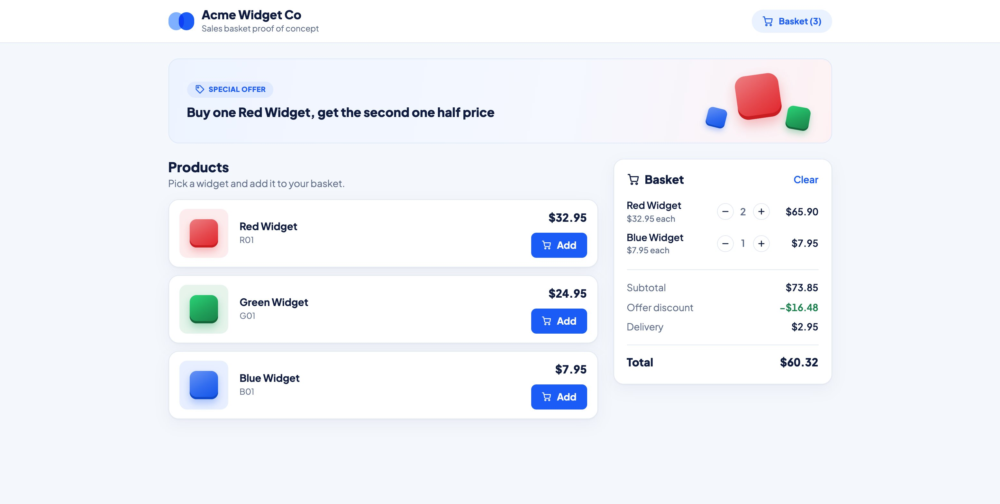

# Acme Widget Co Basket

A proof of concept sales basket for Acme Widget Co. The backend is PHP and the frontend is React with TypeScript.



## Run it

You only need Docker.

```bash
docker compose up
```

- Website: http://localhost:5173
- API: http://localhost:8000/api/v1/products

Run all tests and checks:

```bash
docker compose run --rm composer check
docker compose run --rm web sh -c "npm ci && npm run check"
```

The backend check runs PHP CS Fixer, PHPStan at max level and PHPUnit. The frontend check runs Prettier, oxlint, TypeScript, Vitest and a production build. GitHub Actions runs both on every push, on PHP 8.4 and 8.5.

**Without Docker** you need PHP 8.4 or newer, Composer and Node 24. Run each command in its own terminal from the project folder:

```bash
cd backend && composer install && RATE_LIMIT_PER_MINUTE=300 php -S localhost:8000 -t public
```

```bash
cd frontend && npm ci && npm run dev
```

## How the basket works

The basket is created with the product catalogue, the delivery rules and the offers. `add()` takes a product code and `total()` returns the total in cents.

```php
$basket = new Basket($productRepository, $deliveryRules, ...$offers);
$basket->add('R01');
$basket->add('R01');
$basket->total(); // 5437, which is $54.37
```

The total is worked out in three steps:

1. Add up the price of every item.
2. Take away the offer discount.
3. Add delivery based on what is left: under $50 costs $4.95, under $90 costs $2.95, and $90 or more is free.

Money is kept in whole cents, so there are no rounding errors. Products are listed in `backend/config/products.php`, and delivery rules and offers in `backend/config/store.php`. A new product needs one line in `products.php`. To give its picture a colour, add it to `$widget-colors` and `$widget-tints` in `frontend/src/styles/_tokens.scss`.

## Assumptions

- **Rounding.** Half of $32.95 is $16.475. The example "R01, R01 = $54.37" only works if the customer pays $16.47 for the second one.
- **Delivery is based on the price after the discount.** Two red widgets cost $49.42 after the offer, so delivery is $4.95.
- **The offer applies to every pair.** Four red widgets means two are half price.
- **Offers stack**, but the total discount can never be more than the subtotal.
- **An empty basket costs $0**, with no delivery.
- **Unknown product codes are rejected**, not skipped. Codes are case sensitive, so `r01` is unknown.
- The task only asks for `add`. The page also has plus and minus buttons to make it easier to use.

## Design decisions

- **Stateless API.** The page keeps the list of product codes and sends the whole list every time it changes. The server builds a fresh basket and prices it. There are no sessions, every request can be tested on its own, and any number of servers could answer. Prices are always worked out on the server.
- **No framework.** One small domain with three endpoints is clearer with a small router and plain PHP classes. The domain code does not depend on the HTTP code, so it could move into Laravel or Symfony unchanged.
- **One price breakdown.** `Basket::priceBreakdown()` returns the subtotal, discount, delivery and total in one object, and that object checks that the numbers add up.
- **Responses are checked in the browser.** TypeScript types disappear when the code runs, so each service checks the shape of the JSON before the page uses it. Small hand written checks are enough for three responses. With more, I would use a library such as Zod.

## API

Base URL: `http://localhost:8000/api/v1`

| Method | Endpoint | Body | Response |
| --- | --- | --- | --- |
| GET | `/products` | None | `code`, `name` and `priceInCents` for each product |
| GET | `/offers` | None | `code` and `description` for each active offer |
| POST | `/basket/total` | `{"productCodes": ["R01", "R01"]}` | `lines`, `subtotalInCents`, `discountInCents`, `deliveryInCents` and `totalInCents` |

Errors look like `{"error": "..."}` with one of these status codes: 400 bad JSON, 404 unknown endpoint, 405 wrong method, 415 body not sent as JSON, 422 invalid basket, 429 too many requests, 500 server error.

## Security

- The page only sends product codes. The server looks up every price, so a made up price in the request is ignored.
- A product code must be 1 to 32 letters or digits, and a basket holds at most 100 items. The page keeps its own copy of this limit to disable the add buttons. The two are kept in sync by hand.
- Each IP address can send 25 basket requests a minute. Change this with `RATE_LIMIT_PER_MINUTE`. After that the API returns 429 with a `Retry-After` header, and the page says how long to wait. Reading products and offers is not limited, and requests to wrong URLs do not count. Docker Compose sets the limit to 300 because all browser requests come through the Vite dev server and share one IP.
- POST bodies must be sent as `application/json`. Every response has `X-Content-Type-Options: nosniff` and `Cache-Control: no-store`.
- Errors and blocked requests are logged as JSON. See them with `docker compose logs api`. IP addresses are logged as a short SHA256 hash. This hides them from a casual reader but can be reversed, so in production I would use an HMAC with a secret key.
- The font is bundled with the app, not loaded from Google Fonts.

## Project layout

- `backend/src/Domain`: basket, products, delivery rules, offers and the price breakdown
- `backend/src/Repository`: finds products, kept in memory for now
- `backend/src/Service`: builds a basket from a list of product codes
- `backend/src/Http`: router, controllers, request and response classes, rate limiter
- `backend/src/Application.php`: turns the PHP server variables into a request and returns a safe 500 error if anything fails
- `backend/tests`: PHPUnit tests, laid out like `src`
- `frontend/src`: API client, services, hooks, components and styles, with Vitest tests next to the code

## Limitations and production

- This setup is for development. `php -S` handles one request at a time, and the code is mounted from your disk. In production I would build an image with the code and `composer install --no-dev`, run it with PHP FPM and Nginx or with FrankenPHP, add a health check, and serve the built frontend from the same domain so no CORS setup is needed.
- Products are kept in memory. A database would only need a new `ProductRepository` class.
- The rate limiter keeps its counters in files, so it only works on one server. It uses a fixed window, so a client can briefly send up to twice the limit, and old counter files are never deleted. Redis with a sliding window and expiring keys would fix all three.
- The limit is per IP address, so people behind one office IP share it. A real shop would limit per session or per user.
- If loading the offers fails, the offer banner is simply hidden. The basket still prices the offer correctly.
- There are no user accounts, and orders are not saved.
